# Домашнее задание к занятию «Защита сети» - Петр Петров
**Подготовка к выполнению заданий**  
1. Подготовка защищаемой системы:  
- установите Suricata,  
- установите Fail2Ban.  
2. Подготовка системы злоумышленника: установите nmap и thc-hydra либо скачайте и установите Kali linux.
Обе системы должны находится в одной подсети.  

### Задание 1.
Проведите разведку системы и определите, какие сетевые службы запущены на защищаемой системе:  

sudo nmap -sA < ip-адрес >  

sudo nmap -sT < ip-адрес >  

sudo nmap -sS < ip-адрес >  

sudo nmap -sV < ip-адрес >  

По желанию можете поэкспериментировать с опциями: https://nmap.org/man/ru/man-briefoptions.html.  

В качестве ответа пришлите события, которые попали в логи Suricata и Fail2Ban, прокомментируйте результат.  

### Решение 1.

1. Запускаем ACK-scan (Определение фильтрации портов):  
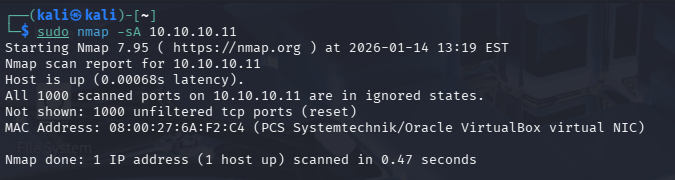  
Открытые сервисы данным типом сканирования Suricata не выявила.  
Поскольку ACK-scan не открывает соединения, не трогает сервисы.  

2. Запускаем TCP scan(полное TCP‑соединение):  
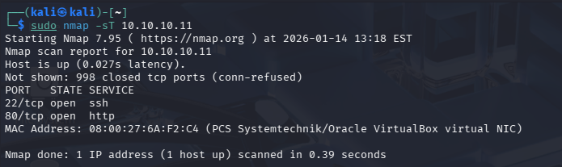  
Результат совпадает с -sS  
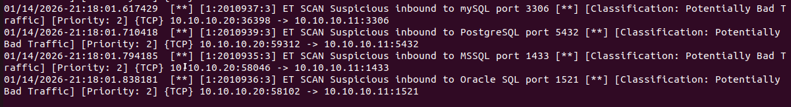  

3. Запускаем SYN-scan (скрытное определение открытых портов):  
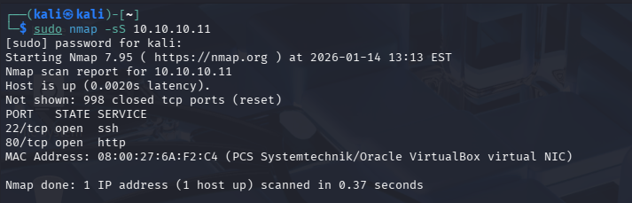  
Хост доступен  
Открыты SSH (22/tcp) и HTTP (80/tcp)  
Остальные порты закрыты (RST)  

Suricata зафиксировала много SYN на разные стандартные сервисные порты:  
А также, ip-адрес атакующего хоста.  
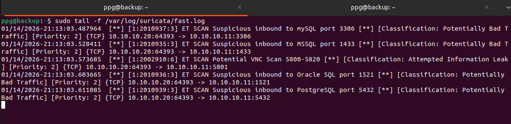  

4. Запускаем сканирование определение версий сервисов:  
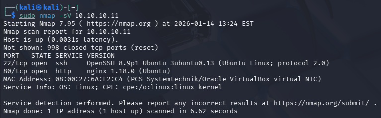  
Запущены службы SSH OpenSSH версии 8.9p1 и HTTP версии nginx 1.18.0

Suricata зафиксировала активное определение сервисов:  
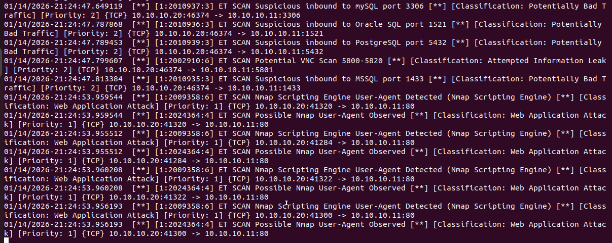  

### Задание 2.
Проведите атаку на подбор пароля для службы SSH:  

hydra -L users.txt -P pass.txt < ip-адрес > ssh  

Настройка hydra:  
создайте два файла: users.txt и pass.txt;  
в каждой строчке первого файла должны быть имена пользователей, второго — пароли. В нашем случае это могут быть случайные строки, но ради эксперимента можете добавить имя и пароль существующего пользователя.  
Дополнительная информация по hydra: https://kali.tools/?p=1847.  

Включение защиты SSH для Fail2Ban:  
открыть файл /etc/fail2ban/jail.conf,  
найти секцию ssh,  
установить enabled в true.  
Дополнительная информация по Fail2Ban:https://putty.org.ru/articles/fail2ban-ssh.html.  

В качестве ответа пришлите события, которые попали в логи Suricata и Fail2Ban, прокомментируйте результат.  

### Решение 2.

События, попавшие в Suricata при подборе пароля для службы SSH:  

`hydra -L users.txt -P pass.txt 10.10.10.11 ssh`

`01/14/2026-22:46:45.503097  [**] [1:2001219:20] ET SCAN Potential SSH Scan [**] [Classification: Attempted Information Leak] [Priority: 2] {TCP} 10.10.10.20:59492 -> 10.10.10.11:22
01/14/2026-22:46:45.503097  [**] [1:2003068:7] ET SCAN Potential SSH Scan OUTBOUND [**] [Classification: Attempted Information Leak] [Priority: 2] {TCP} 10.10.10.20:59492 -> 10.10.10.11:22
01/14/2026-22:46:45.503163  [**] [1:2001219:20] ET SCAN Potential SSH Scan [**] [Classification: Attempted Information Leak] [Priority: 2] {TCP} 10.10.10.20:59522 -> 10.10.10.11:22
01/14/2026-22:46:45.503163  [**] [1:2003068:7] ET SCAN Potential SSH Scan OUTBOUND [**] [Classification: Attempted Information Leak] [Priority: 2] {TCP} 10.10.10.20:59522 -> 10.10.10.11:22
01/14/2026-22:46:45.579940  [**] [1:2260002:1] SURICATA Applayer Detect protocol only one direction [**] [Classification: Generic Protocol Command Decode] [Priority: 3] {TCP} 10.10.10.11:22 -> 10.10.10.20:59526
01/14/2026-22:46:48.725163  [**] [1:2003068:7] ET SCAN Potential SSH Scan OUTBOUND [**] [Classification: Attempted Information Leak] [Priority: 2] {TCP} 10.10.10.20:59556 -> 10.10.10.11:22
01/14/2026-22:46:48.726076  [**] [1:2260002:1] SURICATA Applayer Detect protocol only one direction [**] [Classification: Generic Protocol Command Decode] [Priority: 3] {TCP} 10.10.10.11:22 -> 10.10.10.20:59556
01/14/2026-22:46:48.776201  [**] [1:2260002:1] SURICATA Applayer Detect protocol only one direction [**] [Classification: Generic Protocol Command Decode] [Priority: 3] {TCP} 10.10.10.20:59580 -> 10.10.10.11:22
01/14/2026-22:46:48.791039  [**] [1:2260002:1] SURICATA Applayer Detect protocol only one direction [**] [Classification: Generic Protocol Command Decode] [Priority: 3] {TCP} 10.10.10.20:59612 -> 10.10.10.11:22
01/14/2026-22:46:48.832391  [**] [1:2003068:7] ET SCAN Potential SSH Scan OUTBOUND [**] [Classification: Attempted Information Leak] [Priority: 2] {TCP} 10.10.10.20:59632 -> 10.10.10.11:22
01/14/2026-22:46:48.836233  [**] [1:2260002:1] SURICATA Applayer Detect protocol only one direction [**] [Classification: Generic Protocol Command Decode] [Priority: 3] {TCP} 10.10.10.20:59632 -> 10.10.10.11:22
01/14/2026-22:46:48.875814  [**] [1:2260002:1] SURICATA Applayer Detect protocol only one direction [**] [Classification: Generic Protocol Command Decode] [Priority: 3] {TCP} 10.10.10.11:22 -> 10.10.10.20:59648
01/14/2026-22:46:49.168240  [**] [1:2003068:7] ET SCAN Potential SSH Scan OUTBOUND [**] [Classification: Attempted Information Leak] [Priority: 2] {TCP} 10.10.10.20:59672 -> 10.10.10.11:22
01/14/2026-22:46:49.667904  [**] [1:2003068:7] ET SCAN Potential SSH Scan OUTBOUND [**] [Classification: Attempted Information Leak] [Priority: 2] {TCP} 10.10.10.20:59700 -> 10.10.10.11:22
01/14/2026-22:46:49.702131  [**] [1:2260002:1] SURICATA Applayer Detect protocol only one direction [**] [Classification: Generic Protocol Command Decode] [Priority: 3] {TCP} 10.10.10.20:59710 -> 10.10.10.11:22
01/14/2026-22:46:49.744189  [**] [1:2003068:7] ET SCAN Potential SSH Scan OUTBOUND [**] [Classification: Attempted Information Leak] [Priority: 2] {TCP} 10.10.10.20:59760 -> 10.10.10.11:22
01/14/2026-22:46:49.748640  [**] [1:2260002:1] SURICATA Applayer Detect protocol only one direction [**] [Classification: Generic Protocol Command Decode] [Priority: 3] {TCP} 10.10.10.11:22 -> 10.10.10.20:59760
01/14/2026-22:46:52.279643  [**] [1:2260002:1] SURICATA Applayer Detect protocol only one direction [**] [Classification: Generic Protocol Command Decode] [Priority: 3] {TCP} 10.10.10.20:59782 -> 10.10.10.11:22
01/14/2026-22:46:52.288287  [**] [1:2260002:1] SURICATA Applayer Detect protocol only one direction [**] [Classification: Generic Protocol Command Decode] [Priority: 3] {TCP} 10.10.10.11:22 -> 10.10.10.20:59786
01/14/2026-22:46:52.313403  [**] [1:2003068:7] ET SCAN Potential SSH Scan OUTBOUND [**] [Classification: Attempted Information Leak] [Priority: 2] {TCP} 10.10.10.20:59802 -> 10.10.10.11:22
01/14/2026-22:46:52.335249  [**] [1:2260002:1] SURICATA Applayer Detect protocol only one direction [**] [Classification: Generic Protocol Command Decode] [Priority: 3] {TCP} 10.10.10.20:59826 -> 10.10.10.11:22
01/14/2026-22:46:52.403705  [**] [1:2260002:1] SURICATA Applayer Detect protocol only one direction [**] [Classification: Generic Protocol Command Decode] [Priority: 3] {TCP} 10.10.10.11:22 -> 10.10.10.20:59840
01/14/2026-22:46:52.405895  [**] [1:2260002:1] SURICATA Applayer Detect protocol only one direction [**] [Classification: Generic Protocol Command Decode] [Priority: 3] {TCP} 10.10.10.20:59844 -> 10.10.10.11:22
01/14/2026-22:46:52.413950  [**] [1:2260002:1] SURICATA Applayer Detect protocol only one direction [**] [Classification: Generic Protocol Command Decode] [Priority: 3] {TCP} 10.10.10.20:59850 -> 10.10.10.11:22
01/14/2026-22:46:52.457955  [**] [1:2003068:7] ET SCAN Potential SSH Scan OUTBOUND [**] [Classification: Attempted Information Leak] [Priority: 2] {TCP} 10.10.10.20:59878 -> 10.10.10.11:22
01/14/2026-22:46:52.465030  [**] [1:2260002:1] SURICATA Applayer Detect protocol only one direction [**] [Classification: Generic Protocol Command Decode] [Priority: 3] {TCP} 10.10.10.11:22 -> 10.10.10.20:59862
01/14/2026-22:46:52.565417  [**] [1:2003068:7] ET SCAN Potential SSH Scan OUTBOUND [**] [Classification: Attempted Information Leak] [Priority: 2] {TCP} 10.10.10.20:59886 -> 10.10.10.11:22
01/14/2026-22:46:52.917487  [**] [1:2003068:7] ET SCAN Potential SSH Scan OUTBOUND [**] [Classification: Attempted Information Leak] [Priority: 2] {TCP} 10.10.10.20:59944 -> 10.10.10.11:22
01/14/2026-22:46:52.927091  [**] [1:2260002:1] SURICATA Applayer Detect protocol only one direction [**] [Classification: Generic Protocol Command Decode] [Priority: 3] {TCP} 10.10.10.20:59944 -> 10.10.10.11:22
01/14/2026-22:46:53.042529  [**] [1:2260002:1] SURICATA Applayer Detect protocol only one direction [**] [Classification: Generic Protocol Command Decode] [Priority: 3] {TCP} 10.10.10.11:22 -> 10.10.10.20:59956
01/14/2026-22:46:53.043310  [**] [1:2006546:9] ET SCAN LibSSH Based Frequent SSH Connections Likely BruteForce Attack [**] [Classification: Attempted Administrator Privilege Gain] [Priority: 1] {TCP} 10.10.10.20:59956 -> 10.10.10.11:22
01/14/2026-22:46:53.055296  [**] [1:2260002:1] SURICATA Applayer Detect protocol only one direction [**] [Classification: Generic Protocol Command Decode] [Priority: 3] {TCP} 10.10.10.11:22 -> 10.10.10.20:59960
01/14/2026-22:46:53.087860  [**] [1:2260002:1] SURICATA Applayer Detect protocol only one direction [**] [Classification: Generic Protocol Command Decode] [Priority: 3] {TCP} 10.10.10.20:59988 -> 10.10.10.11:22
01/14/2026-22:46:53.153460  [**] [1:2260002:1] SURICATA Applayer Detect protocol only one direction [**] [Classification: Generic Protocol Command Decode] [Priority: 3] {TCP} 10.10.10.20:59992 -> 10.10.10.11:22
01/14/2026-22:46:53.158139  [**] [1:2003068:7] ET SCAN Potential SSH Scan OUTBOUND [**] [Classification: Attempted Information Leak] [Priority: 2] {TCP} 10.10.10.20:60008 -> 10.10.10.11:22
01/14/2026-22:46:53.932515  [**] [1:2003068:7] ET SCAN Potential SSH Scan OUTBOUND [**] [Classification: Attempted Information Leak] [Priority: 2] {TCP} 10.10.10.20:60066 -> 10.10.10.11:22
01/14/2026-22:46:53.934186  [**] [1:2260002:1] SURICATA Applayer Detect protocol only one direction [**] [Classification: Generic Protocol Command Decode] [Priority: 3] {TCP} 10.10.10.20:60066 -> 10.10.10.11:22
01/14/2026-22:46:54.402106  [**] [1:2260002:1] SURICATA Applayer Detect protocol only one direction [**] [Classification: Generic Protocol Command Decode] [Priority: 3] {TCP} 10.10.10.20:60082 -> 10.10.10.11:22
01/14/2026-22:49:08.259931  [**] [1:2260002:1] SURICATA Applayer Detect protocol only one direction [**] [Classification: Generic Protocol Command Decode] [Priority: 3] {TCP} 10.10.10.20:59912 -> 10.10.10.11:22`

Suricata зафиксировала множественные попытки подключения к SSH (порт 22) с одного IP-адреса за короткий промежуток времени.  

Подбор логина и пароля закончен и найдено одно совпадение по логину и паролю:  
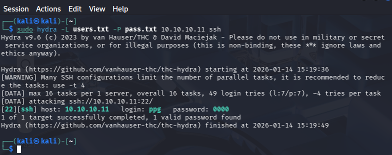  

По логам операционной системы зафиксированы неудачные попытки а также вход:  
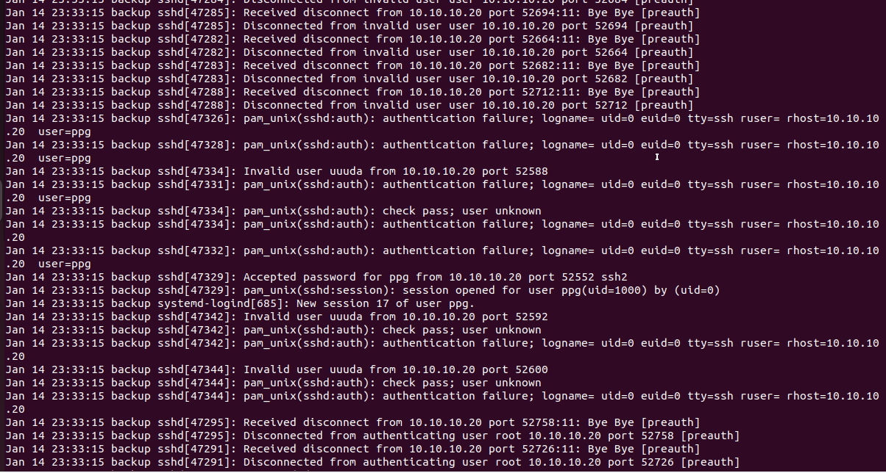  

При включеной службе Fail2Ban подбор логина и пароля не удался:  

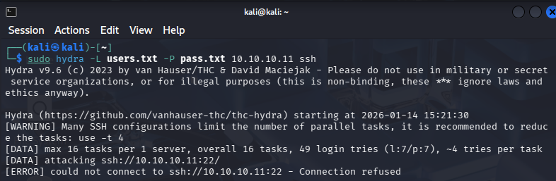  

В логах Fail2Ban видно с адреса 10.10.10.20 осуществлялись нелегитимные попытки подбора логина и пароля и ip-адрес был заблокирован:  

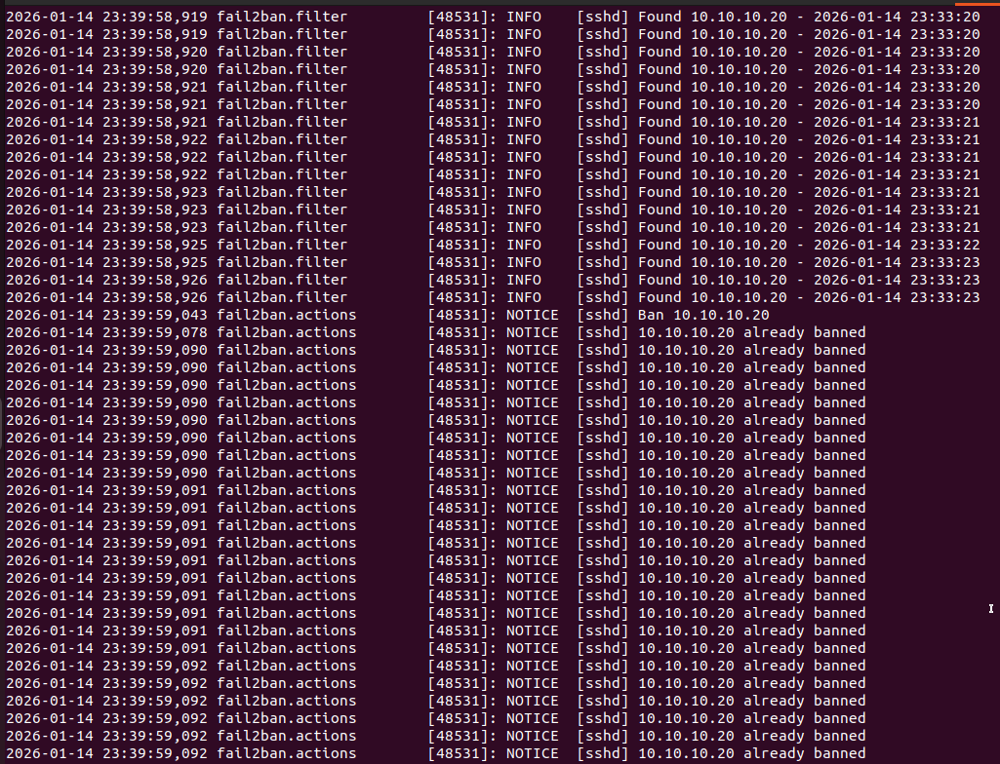   

Совместное использование Suricata и Fail2Ban обеспечивает:  

- обнаружение сетевой разведки,  

- защиту от атак перебора паролей.  
